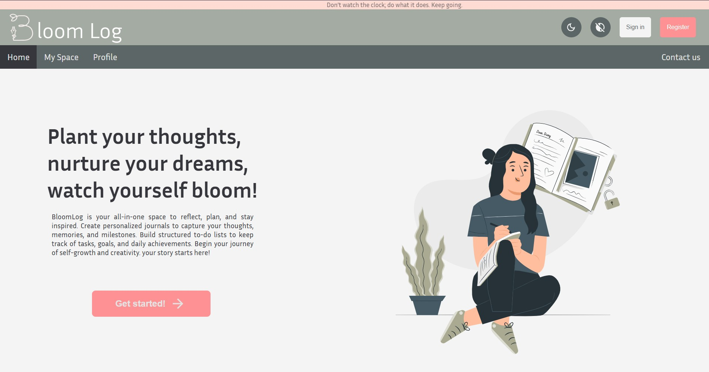
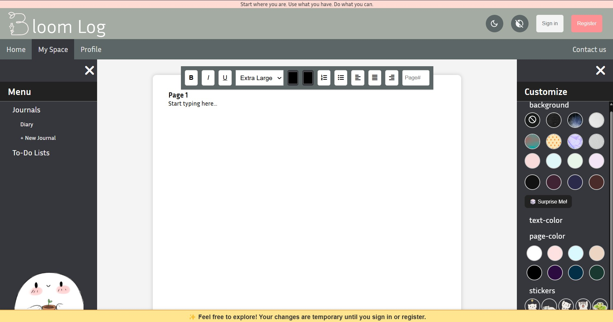
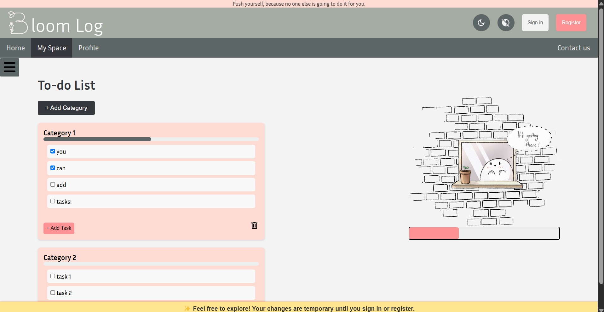
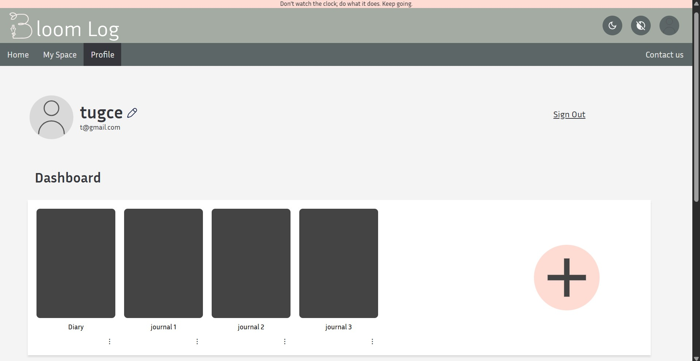

# 🌸 BloomLog

BloomLog is a full-stack journaling and to-do list web application developed as a group project. Built with HTML, CSS, JavaScript, Node.js, and Express, it offers customizable themes and a user-friendly interface.
Designed with productivity, personalization, and a touch of aesthetic in mind.


------

## ✨ Features

- User authentication (register/login)
- Create, edit, and delete journal entries
- To-do list with progress tracking
- Customizable themes and backgrounds
- High-contrast theme option for better accessibility
- Personalized user data storage

------

## 📸 Screenshots

### 🏠 Home Page


### 📓 Journal Entry


### ✅ To-Do List


### 👤 Profile Page


------

## 🛠️ Tech Stack

- **Frontend:** HTML, CSS, JavaScript
- **Backend:** Node.js, Express
- **Middleware:** CORS
- **Testing:** Jest, Supertest
- **Data Storage:** JSON-based local storage

------

## 🚀 Getting Started

To run BloomLog locally:

**1. Clone the repository**
git clone https://github.com/armitashahim/bloomlog.git

**2. Navigate into the project folder**
cd bloomlog

**# 3. Install dependencies**
npm install

**# 4. Start the server**
node server.js

**# 5. Visit http://localhost:3000 in your browser.**

------

## 🗂️ Project Structure
```
bloomlog/
├── server.js                 # Express backend server
├── package.json              # Project dependencies
├── package-lock.json         # Exact dependency versions (autogenerated)
├── data.json                 # JSON-based local storage
├── .gitignore                # Prevents node_modules from being committed
├── views/                    # HTML pages served by Express
│   ├── home.html
│   ├── journal.html
│   ├── todoList.html
│   ├── contactUs.html
│   ├── register.html
│   ├── signIn.html
│   └── profile.html
├── static/                   # All frontend assets
│   ├── BloomLog.js           # Main frontend JavaScript
│   ├── home.css
│   ├── journal.css
│   ├── todoList.css
│   ├── contactUs.css
│   ├── register.css
│   ├── signIn.css
│   ├── profile.css
│   └── Images/               # Image files 
├── testing/                  # Test environment 
│   ├── BloomLog.test.js      # Backend tests with Jest + Supertest
│   ├── package.json          # Testing dependencies
│   ├── package-lock.json     # Testing dependency versions
```
------

## 🙋‍♀️ About Me

Hi! I’m Armita, a first-year Computer Science student at York University.
I contributed to the development of BloomLog as part of a team project, focusing on both frontend and backend functionality.
I enjoy building projects that combine logic, design, and creativity — and BloomLog gave me the perfect opportunity to do just that.

Connect with me:
[](https://github.com/armitashahim)
[](https://www.linkedin.com/in/armita-shahim-63598b323/)

------

## 👥 Contributors

BloomLog was developed as a collaborative group project by:

- **Armita Shahim** – Frontend/backend integration, routing, UI logic, UI/UX design and shared work on HTML & CSS
- **Busra Tugce Kurt** – Logo creation, custom digital illustrations, visual branding elements, UI/UX design and shared work on HTML & CSS

> This repository is maintained by Armita Shahim for portfolio/demo purposes.

------

## 📬 Feedback

Found a bug? Have ideas for new features?
Open an issue or reach out — We'd love to hear from you!

Thanks for checking out BloomLog! 💜

